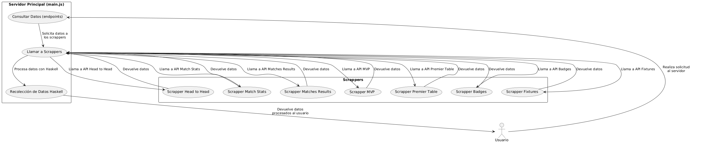

# Backend Data Fetch - Modelos de Programación II
## Universidad Distrital Francisco José de Caldas
### Proyecto Curricular de Ingeniería de Sistemas

**Asignatura:** Modelos de Programación II  
**Profesor:** Alejandro Paolo Daza Corredor

### Integrantes

- Amir Zoleyt Vanegas Cárdenas - 20211020015 <br> azvanegasc@udistrital.edu.co
- Esteban Alejandro Villalba Delgadillo - 20212020064 <br> eavillalbad@udistrital.edu.co
- Samuel Antonio Sanchez Peña - 20212020151 <br> samasanchezp@udistrital.edu.co

---

## Descripción del Proyecto

Este proyecto consiste en la implementación de un backend en Node.js que recopila datos sobre la Premier League a través de múltiples APIs. Los datos incluyen información sobre partidos, estadísticas, jugadores, tablas de posiciones y más. El backend está diseñado de manera **modular**, centralizando toda la lógica de análisis y recolección de datos en un único endpoint que posteriormente es procesado a través de Haskell.

El objetivo principal es proporcionar una interfaz centralizada para acceder a datos actualizados de la Premier League, lo cual facilita el análisis de la información sin necesidad de realizar múltiples solicitudes a diferentes fuentes.

Los scrappers del proyecto están implementados con **programación imperativa**, siguiendo un enfoque donde cada uno realiza tareas específicas de manera secuencial. La estructura modular permite que cada scrapper sea independiente, lo cual facilita el mantenimiento y la expansión del sistema.

---

## Características del Proyecto

El proyecto está estructurado de la siguiente manera:

### Scrappers Modulares

- Cada módulo (scrapper) está diseñado para manejar diferentes aspectos de la información de la Premier League, como resultados de partidos, estadísticas de jugadores, etc.
- Los módulos ahora usan APIs para obtener los datos, eliminando la necesidad de web scraping.
- La lógica de todos los módulos se centraliza en un único archivo (`main.js`), que se encarga de hacer las solicitudes y enviar todos los datos a un solo endpoint para su posterior análisis en Haskell.

### Servidor Centralizado

- Un servidor Express centraliza todos los módulos y expone los datos a través de un solo endpoint HTTP.
- Los datos obtenidos se procesan y se envían de manera eficiente a través de Haskell para su análisis.

### Datos Disponibles

- **Resultados de partidos:** Información sobre partidos jugados y por jugar.
- **Estadísticas de partidos:** Datos detallados como posesión, tiros, pases, tarjetas amarillas, etc.
- **Tabla de posiciones:** Clasificación actual de los equipos en la Premier League.

### Formato de Respuesta

Todos los endpoints devuelven los datos en formato JSON, lo que facilita su integración con frontends o aplicaciones móviles.

---

## Estructura del Proyecto

El proyecto está organizado de la siguiente manera:
```bash
Backend_DataFetch_JavaScript_Modelos-II/
├── backend_statics/               # Carpeta con los módulos de scrappers
│   ├── Scrapper_Badges.js         # Scrapper para obtener badges de equipos
│   ├── Scrapper_Fixtures.js       # Scrapper para obtener fixtures (partidos)
│   ├── Scrapper_Head_to_Head.js   # Scrapper para obtener datos de enfrentamientos directos
│   ├── Scrapper_Match_Stats.js    # Scrapper para obtener estadísticas de partidos
│   ├── Scrapper_Matches_Results.js# Scrapper para obtener resultados de partidos
│   ├── Scrapper_MVP.js            # Scrapper para obtener el MVP de un partido
│   └── Scrapper_Premier_Table.js  # Scrapper para obtener la tabla de posiciones
├── main.js                        # Punto de entrada del servidor
├── package.json                   # Dependencias y configuración del proyecto
└── README.md                      # Documentación del proyecto
```

## Endpoints Disponibles

El servidor expone los siguientes endpoints:

- **Badges:**
  - **URL:** /badges
  - **Descripción:** Obtiene los badges (escudos) de los equipos de la Premier League.
  - **Método:** GET

- **Fixtures:**
  - **URL:** /fixtures
  - **Descripción:** Obtiene los fixtures (partidos programados) de la Premier League.
  - **Método:** GET

- **Head-to-Head:**
  - **URL:** /head_to_head
  - **Descripción:** Obtiene datos de enfrentamientos directos entre dos equipos.
  - **Método:** GET

- **Match Stats:**
  - **URL:** /match_stats
  - **Descripción:** Obtiene estadísticas detalladas de un partido específico.
  - **Método:** GET

- **Matches Results:**
  - **URL:** /matches_results
  - **Descripción:** Obtiene los resultados de los partidos jugados.
  - **Método:** GET

- **MVP:**
  - **URL:** /mvp
  - **Descripción:** Obtiene el MVP (Mejor Jugador del Partido) de un partido específico.
  - **Método:** GET

- **Premier Table:**
  - **URL:** /premier_table
  - **Descripción:** Obtiene la tabla de posiciones actual de la Premier League.
  - **Método:** GET

---

## Diagramas

### Diagrama de Arquitectura

A continuación se presenta el diagrama de arquitectura del sistema, que describe la interacción entre los diferentes componentes y cómo el backend centraliza la recopilación de datos desde las APIs para luego procesarlos a través de Haskell.



---
## Instrucciones de Ejecución

### Requisitos Previos

- Node.js (v16 o superior)
- npm (Node Package Manager)

### Pasos para Ejecutar el Proyecto

1. **Clonar el repositorio:**

    ```bash
    git clone https://github.com/tu-usuario/Backend_DataFetch_JavaScript_Modelos-II.git
    ```

2. **Navegar al directorio del proyecto:**

    ```bash
    cd Backend_DataFetch_JavaScript_Modelos-II
    ```

3. **Instalar dependencias:**

    ```bash
    npm install
    ```

4. **Ejecutar el servidor:**

    ```bash
    node main.js
    ```

5. **Acceder a los endpoints:**

    Se abre el navegador o alguna herramienta como curl o Postman para acceder a los endpoints.

    Ejemplo: [http://localhost:3000/fixtures](http://localhost:3000/fixtures)

---

## Ejemplo de Uso

### Obtener Fixtures (Partidos Programados)

**URL:** `http://localhost:3000/fixtures`

**Respuesta:**

```json
[
  {
    "homeTeam": "Chelsea",
    "awayTeam": "Manchester United",
    "date": "2023-10-15T14:00:00Z",
    "status": "Scheduled"
  },
  {
    "homeTeam": "Liverpool",
    "awayTeam": "Arsenal",
    "date": "2023-10-16T16:30:00Z",
    "status": "Scheduled"
  }
]
